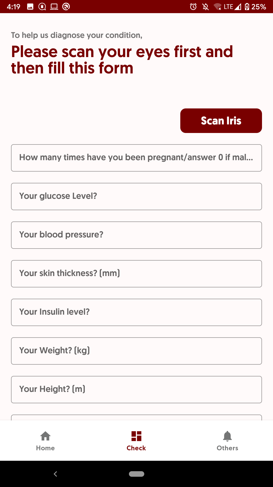
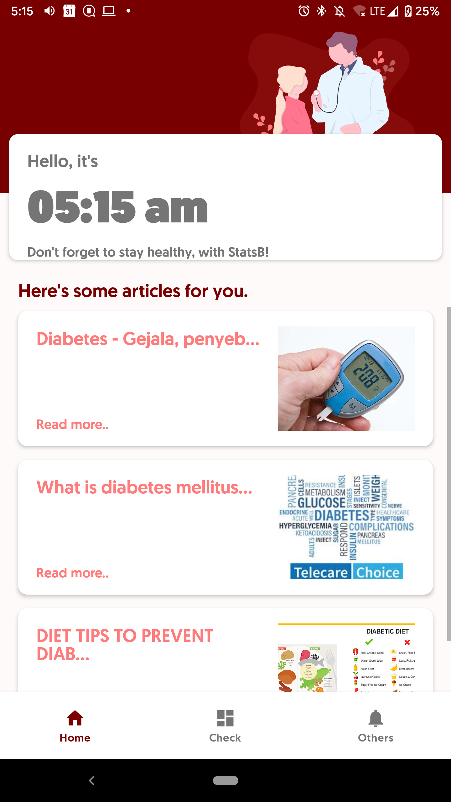
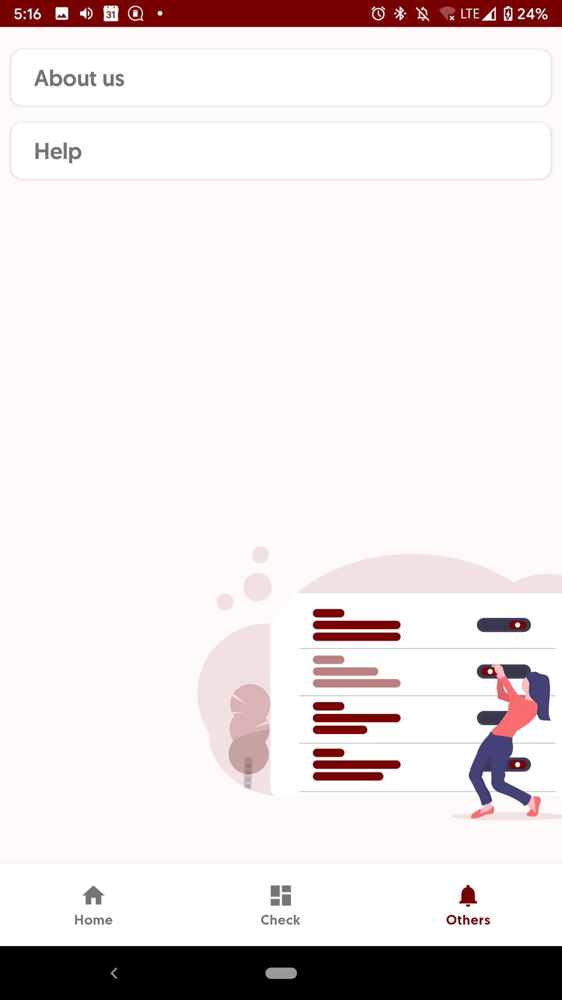
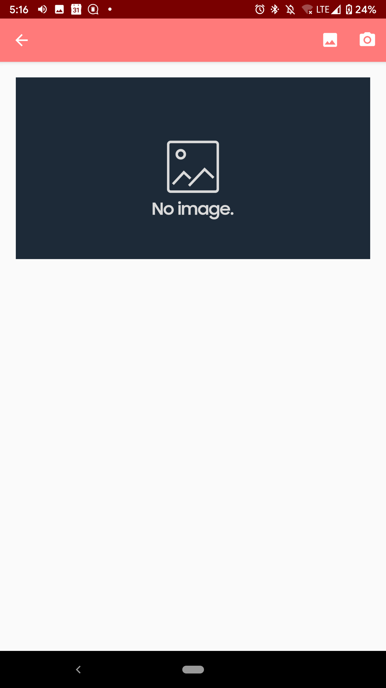
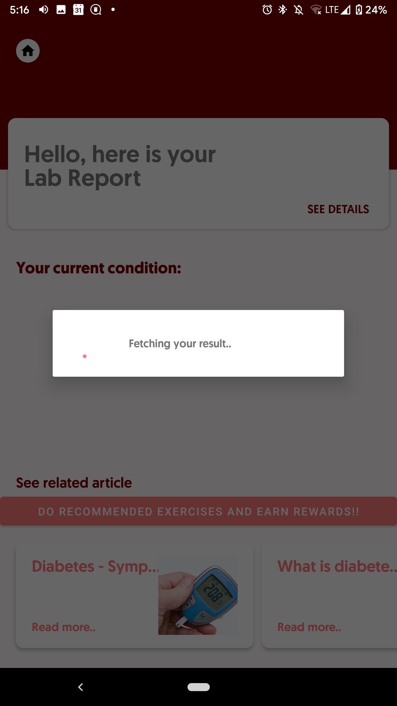
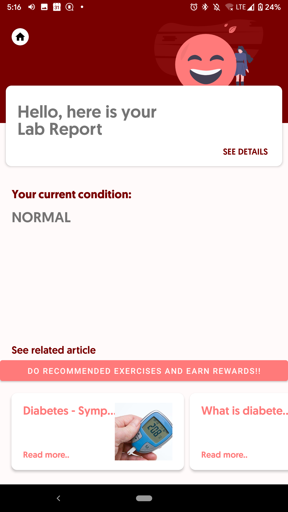
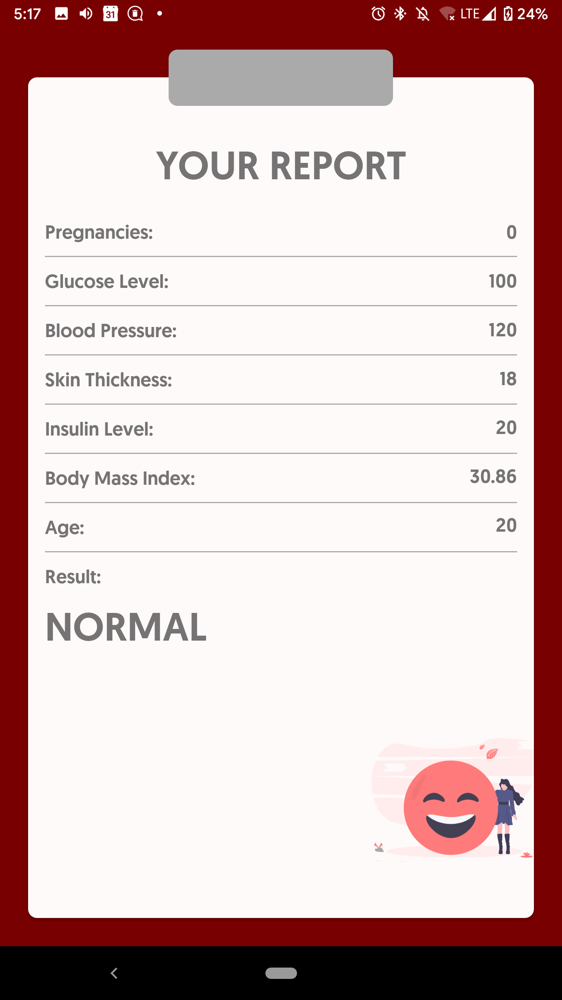
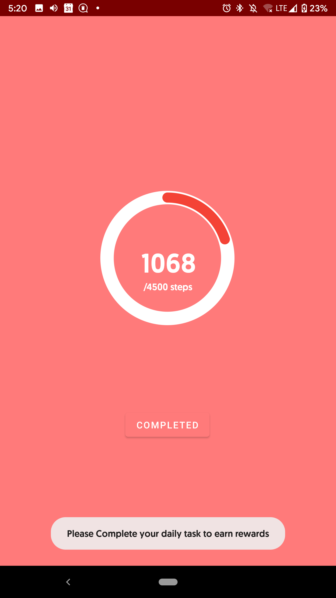

# statsB

[**PROTOTYPE VIDEO**](https://youtu.be/zuky1PGAVLc)

Diabetes is the fastest growing chronic disease in the world affecting more than 400 million people world wide. 
As there is no cure for it; patients have to constantly monitor and measure their blood sugar level upto 4-5 times per day.
The problem is its done through these invasive finger stick tests which aren't only painful and inefficient but also a new strip is required every single time and hence is extremely expensive, costing patients thousands of rupees monthly.
Diabetic retinopathy is a diabetes complication that affects eyes and might further lead to blindness if not detected and rectified.
Our blood glucose levels are highly co-related to our glucose levels in the eye and by analyzing images of the eye we can determine chances of having diabetes and detects whether you have diabetic retinopathy or not by looking at  images of eyes in the specific part of iris.
A person has to capture image of their own eyes. 
From here, statsB analyses the images and provides the reading to the user at virtually no cost under a second; without any pain, blood and risk of infection of traditional method.

**StatsB**

    
       
